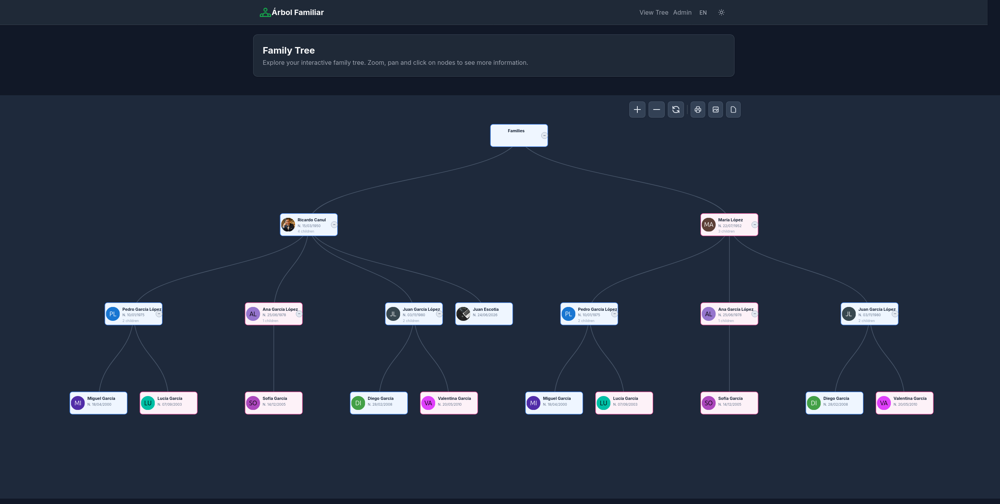
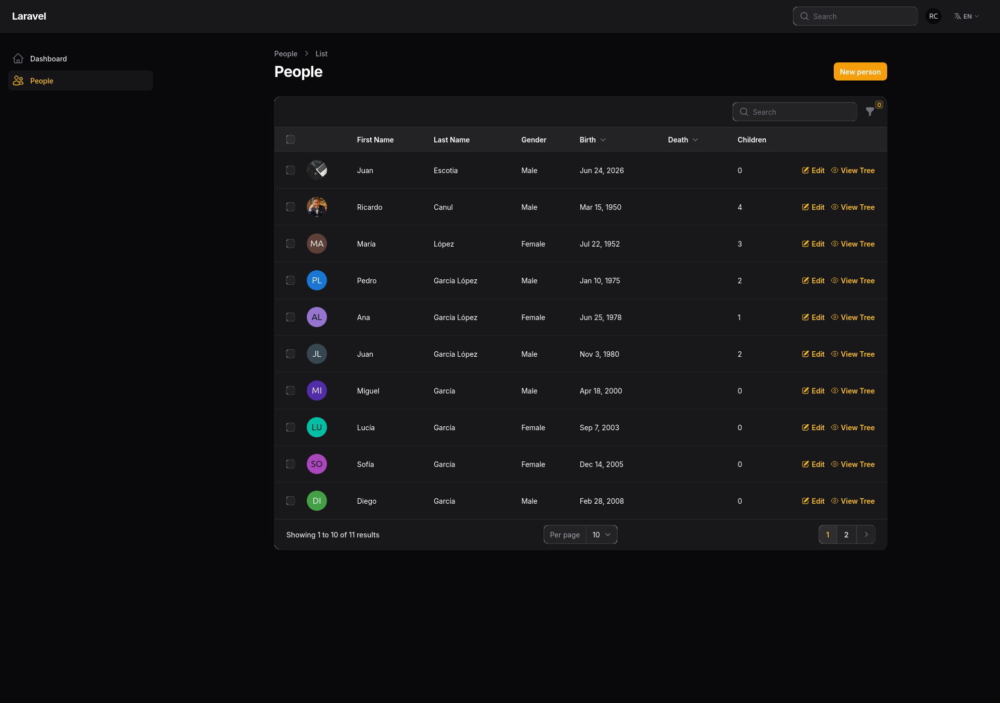
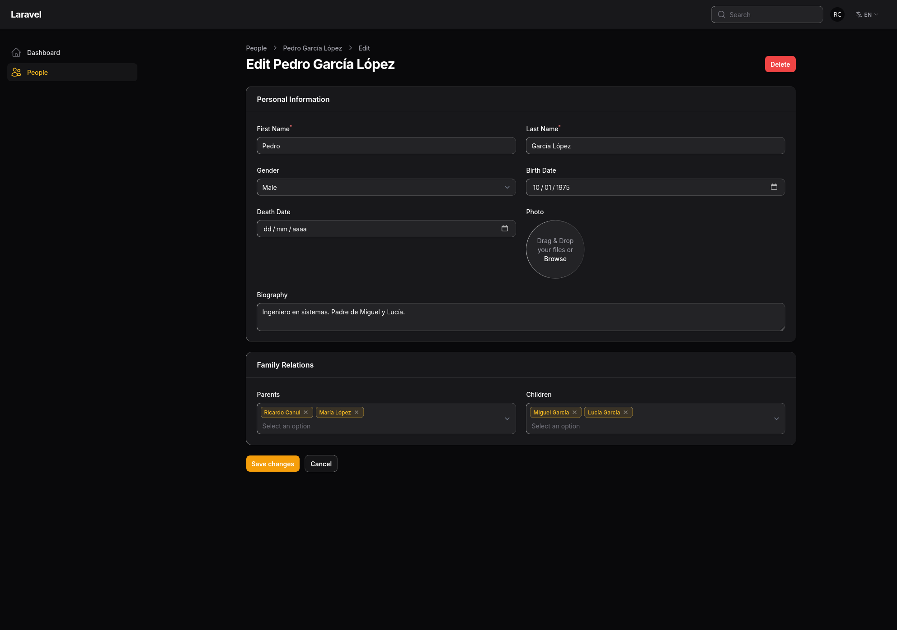
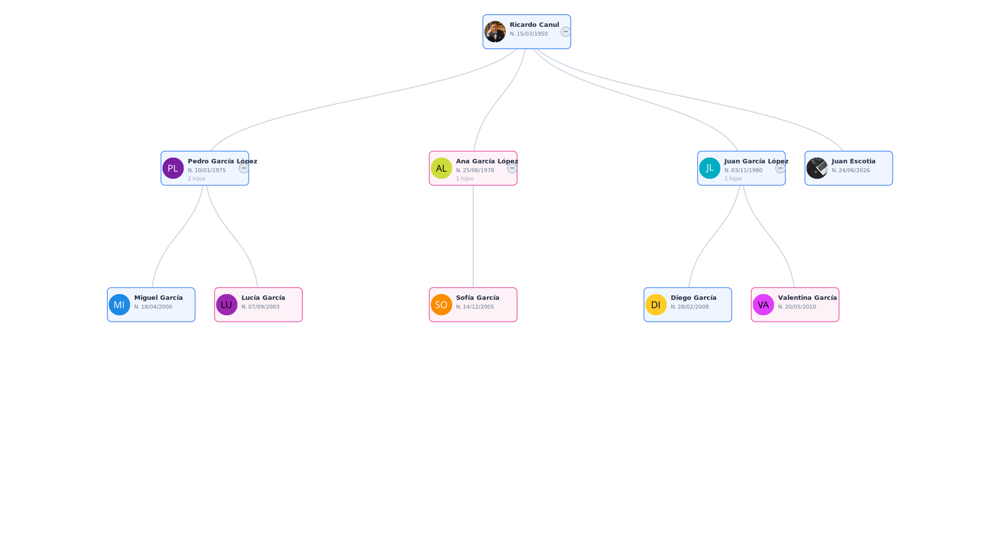

# Family Tree - Interactive Family Tree

Web application for managing and visualizing interactive family trees built with Laravel 13, Filament Admin and D3.js.

## Screenshots

| Family Tree | Admin Panel | Edit Person |
|:---:|:---:|:---:|
|  |  |  |
| Interactive family tree view with D3.js. Zoom, pan, collapse/expand nodes. | Filament panel with people listing, gender filters, circular photo and actions. | Edit form with personal information, photo and family relationships. |

| SVG Export |
|:---:|
|  |
| The tree can be exported to SVG vector format. |

## Stack

- **Backend:** Laravel 13 + PHP 8.3
- **Database:** MySQL 8.0
- **Admin Panel:** Filament Admin v3
- **Frontend:** Tailwind CSS 4 + Vite 8 + Alpine.js (via CDN)
- **Visualization:** D3.js v7 (interactive family tree)
- **Infrastructure:** Docker (PHP 8.3-fpm + Nginx + MySQL)

## Requirements

- Docker and Docker Compose

## Installation & Usage

```bash
# 1. Clone the repository
git clone <repo-url> family-tree
cd family-tree

# 2. Start containers
docker compose up -d --build

# 3. Install Composer dependencies and configure
docker compose exec app composer install

# 4. Configure .env (verify DB_HOST=db, DB_PORT=3306)
docker compose exec app php artisan key:generate

# 5. Run migrations and seed
docker compose exec app php artisan migrate
docker compose exec app php artisan db:seed

# 6. Create admin user (for Filament panel)
docker compose exec app php artisan make:filament-user
```

Or in a single step:
```bash
docker compose exec app composer run setup
```

## Access

| Site               | URL                                       |
|--------------------|-------------------------------------------|
| Public tree        | http://localhost:8080                     |
| Filament Admin     | http://localhost:8080/admin               |
| Tree by person     | http://localhost:8080/tree/{id}           |
| API (full)         | http://localhost:8080/api/tree/full       |
| API (by person)    | http://localhost:8080/api/tree/{id}       |

> To change the port, edit `"8080:80"` in `docker-compose.yml`.

## Features

- **Interactive tree**: zoom, pan, collapsible/expandable nodes with D3.js v7
- **Filament admin panel**: full CRUD with photo, parent/child relationships, filters
- **Person view**: tree from a specific member
- **SVG export**: download the tree as a vector image
- **Dark mode**: with localStorage persistence
- **Internationalization**: English, Español, Polski
- **Photos and avatars**: real photo or auto-generated avatar
- **Info modal**: full data and biography when clicking a node

## Project Structure

```
├── docker-compose.yml       # Services: app (PHP), web (Nginx), db (MySQL)
├── Dockerfile               # PHP 8.3-fpm with extensions
├── nginx/default.conf       # Nginx configuration
├── php/local.ini            # PHP configuration
├── docs/                    # Documentation
│   ├── screenshots/         # Screenshots
│   ├── ARCHITECTURE.md      # Technical architecture
│   ├── API.md               # API reference
│   └── DEPLOYMENT.md        # Deployment guide
└── src/                     # Laravel code
    ├── app/
    │   ├── Models/Person.php           # Person model
    │   ├── Models/Relationship.php     # Parent-child relationship
    │   ├── Filament/Resources/PersonResource.php  # Admin CRUD
    │   ├── Http/Controllers/FamilyTreeController.php
    │   └── Http/Middleware/SetLocale.php
    ├── database/
    │   ├── migrations/       # create_people, create_relationships
    │   └── seeders/FamilyTreeSeeder.php  # 3 García generations
    ├── lang/{en,es,pl}.json  # Translations
    ├── resources/views/
    │   ├── layouts/app.blade.php
    │   └── family-tree/
    │       ├── index.blade.php  # General tree (D3.js)
    │       └── tree.blade.php   # Tree by person (D3.js)
    └── routes/web.php
```

## Useful Commands

```bash
# Full setup
docker compose exec app composer run setup

# Development (server + logs + vite)
docker compose exec app composer run dev

# Run tests
docker compose exec app composer run test

# View logs
docker compose exec app tail -f storage/logs/laravel.log

# Access MySQL
docker compose exec db mysql -u family_tree_user -p family_tree

# Fresh migrate with data
docker compose exec app php artisan migrate:fresh --seed
```

## Troubleshooting

**Error 500:**
```bash
docker compose exec app php artisan storage:link
docker compose exec app php artisan optimize:clear
```

**Tree not loading data:** Verify migrations and seed.

**Port 8080 in use:** Change to `"8081:80"` in `docker-compose.yml`.

## Additional Documentation

- [Architecture](docs/ARCHITECTURE.md) - Technical details of the project
- [API](docs/API.md) - Endpoint reference
- [Deployment](docs/DEPLOYMENT.md) - Production guide
